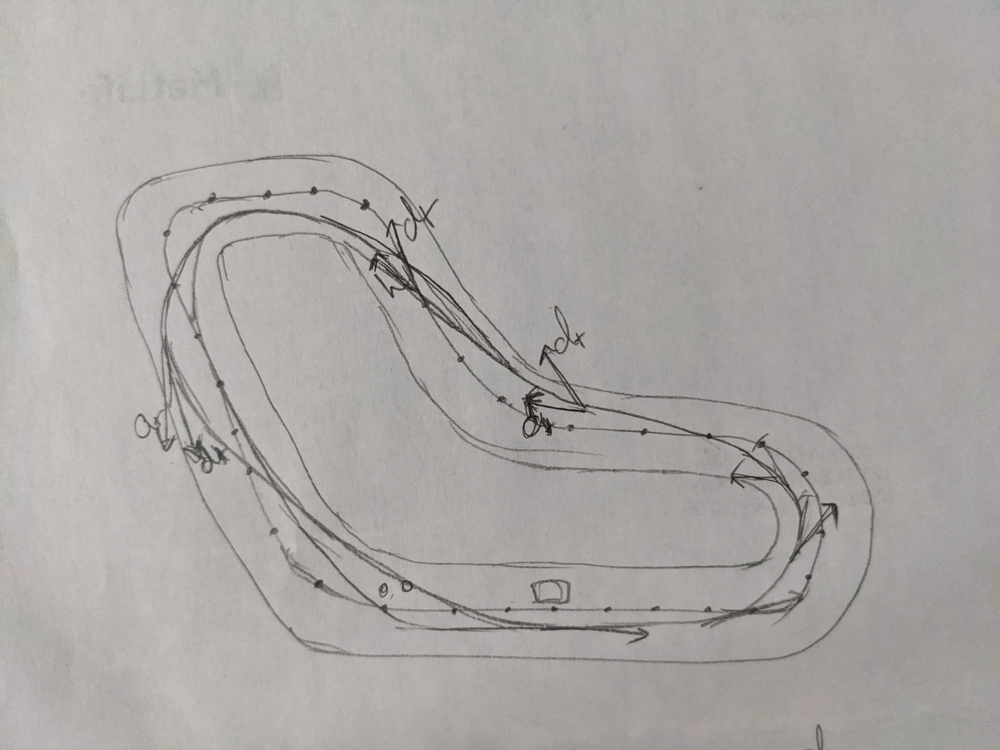

# AWS DeepRacer

This repo is for holding hyper parameters and reward functions for aws deepracer

Race track diagram for maintaining the car near the curve when turning to keep car as straight as possible and to reduce the steering angle to maximize the speed of the car.

|Hyperparameter|Value|
|--------------|-----|
|Gradient descent batch size|128|
|Entropy|0.01|
|Discount factor|0.999|
|Loss type|Huber|
|Learning rate|0.0003|
|Number of experience episodes between each policy-updating iteration|20|
|Number of epochs|3|
